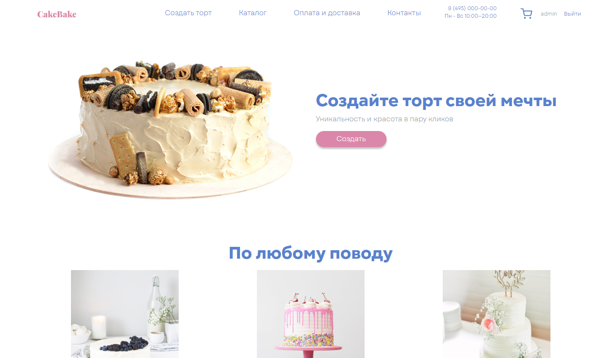
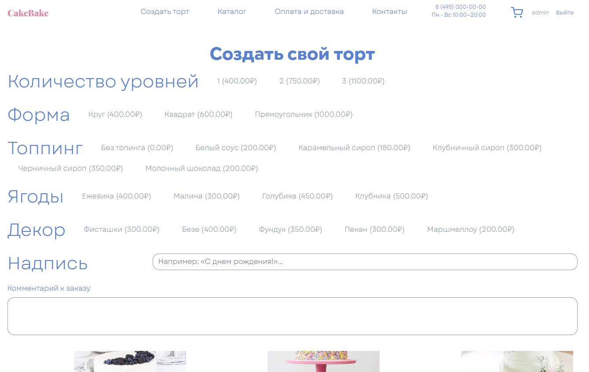
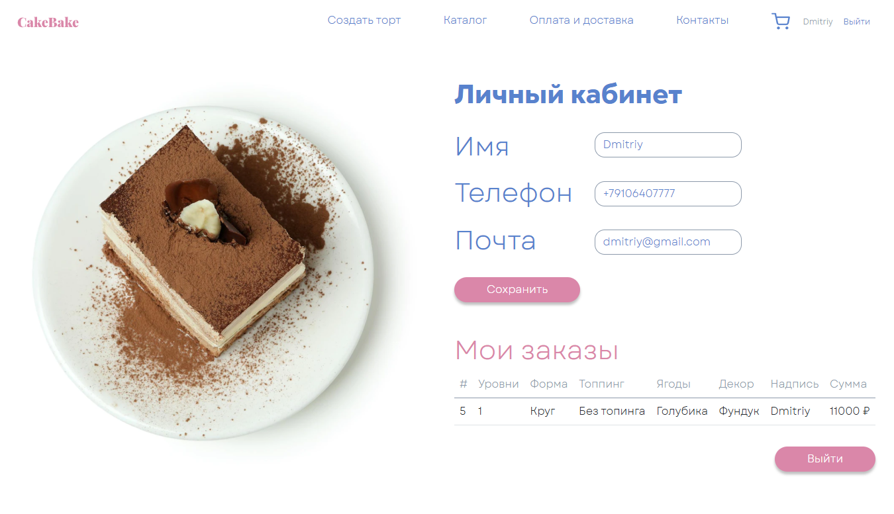
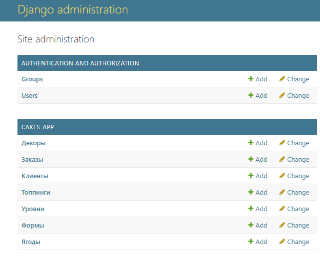

# Сайт магазина тортов на заказ

Сайт магазина тортов на заказ. Здесь можно сделать заказ торта собранного на сайте самим покупателем.



Магазин тортов на заказ. На данный момент магазин имеет несколько стандартных тортов, но также принимает заказы на торты, собранные самим покупателем.

Кастомизация торта, которую на данный момент поддерживает сайт:
- **Количество уровней** (обязательное поле)  
  - 1 уровень (+400р)  
  - 2 уровня (+750р)  
  - 3 уровня (+1100р)  
- **Форма** (обязательное поле)  
  - Квадрат (+600)  
  - Круг (+400)  
  - Прямоугольник (+1000)  
- **Топпинг** (Обязательное поле)  
  - Без топпинга (+0)  
  - Белый соус (+200)  
  - Карамельный сироп (+180)  
  - Кленовый сироп (+200)  
  - Клубничный сироп (+300)  
  - Черничный сироп (+350)  
  - Молочный шоколад (+200)  
- **Ягоды** (Не обязательное для заполнения поле)  
  - Ежевика (+400)  
  - Малина (+300)  
  - Голубика (+450)  
  - Клубника (+500)  
  - Декор (Не обязательное поле)  
  - Фисташки (+300)  
  - Безе (+400)  
  - Фундук (+350)  
  - Пекан (+300)  
  - Маршмеллоу (+200)  
  - Марципан (+280)  
- **Надпись** (Не обязательное поле)  
  Пояснение к полю “Мы можем разместить на торте любую надпись, например: «С днем рождения!»”  
  - Инпут ввода (+500)

Стоимость элементов конструктора торта можно изменять в админ панели.

    ---

## На сайте есть два независимых интерфейса.

__Первый интерфейс__ - часть которую видит пользователь, здесь можно собрать свой торт в конструкторе и сделать заказ, зарегестрироваться, зайти в личный кабинет, просмотреть заказы.

**Главная страница сайта:**


**Конструктор торта:**



**Личный кабинет:**



__Второй интерфейс__ - админ панель. Сюда заходит менеджер, чтобы обновить стоимость, просмотреть заказы, добавить новые элементы для конструктора торта.



----

## Как запустить dev-версию сайта

1. Скопируйте репозиторий с кодом проекта
    ```bash
        git clone https://github.com/RamanSashyn/WebCakes
   ```

2. Откройте терминал и перейдите в каталог проекта, используя команду `cd`, например:
    ```sh
      cd star-burger
    ```

3. [Установите Python](https://www.python.org/), если этого ещё не сделали.

4. Проверьте, что `python` установлен и корректно настроен. Запустите его в командной строке:

    ```sh
    python --version
    ```
**Важно!** Версия Python должна быть не ниже 3.10.

Возможно, вместо команды `python` здесь и в остальных инструкциях этого README придётся использовать `python3`. Зависит это от операционной системы и от того, установлен ли у вас Python старой второй версии. 

5. В каталоге проекта создайте виртуальное окружение:
    ```sh
      python -m venv venv
    ```
6. Активируйте его. На разных операционных системах это делается разными командами:

- Windows: `.\venv\Scripts\activate`
- MacOS/Linux: `source venv/bin/activate`


7. Установите зависимости в виртуальное окружение:
```sh
pip install -r requirements.txt
```

8. Определите переменные окружения `SECRET_KEY`, `DEBUG`, `ALLOWED_HOSTS` Создайте файл `.env` в каталоге `WebCakes/` и положите туда такой код:
```sh
    DEBUG=True
    SECRET_KEY=django-insecure-0if40nf4nf93n4
    ALLOWED_HOSTS='127.0.0.1'
```

9. Создайте файл базы данных SQLite и отмигрируйте её следующей командой:
    ```sh
    python manage.py migrate
    ```

10. Создайте Суперпользователя для возможности захода в админ-панель:
```sh
python manage.py createsuperuser
```

11. Запустите сервер:
```sh
python manage.py runserver
```

- **Откройте** сайт в браузере по адресу [http://127.0.0.1:8000/](http://127.0.0.1:8000/).

**Зайдя** на данный адрес вы увидите главную страницу сайта.


- **Для перехода** в админ панель откройте сайт в браузере по адресу [http://127.0.0.1:8000/admin/](http://127.0.0.1:8000/admin/)


---

## Цели проекта
Код написан в учебных целях — это урок в курсе по Python и веб-разработке на сайте [Devman](https://dvmn.org).


